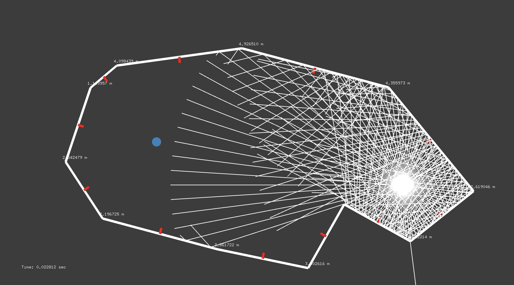
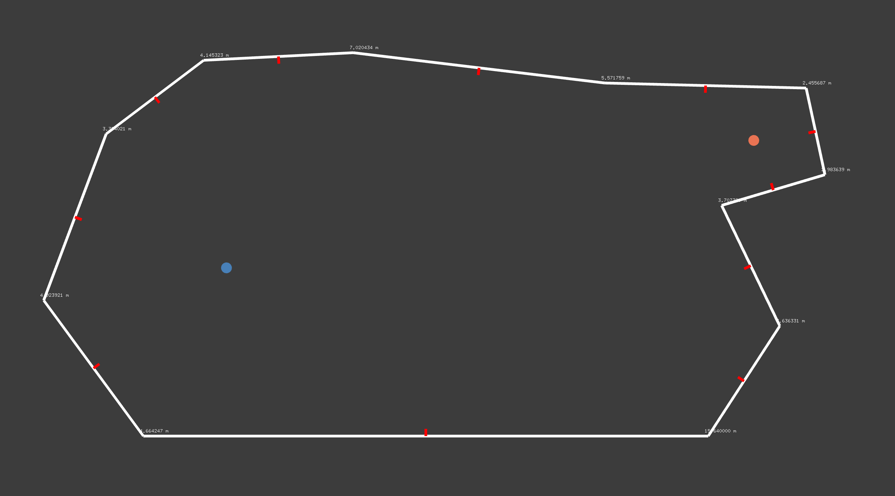
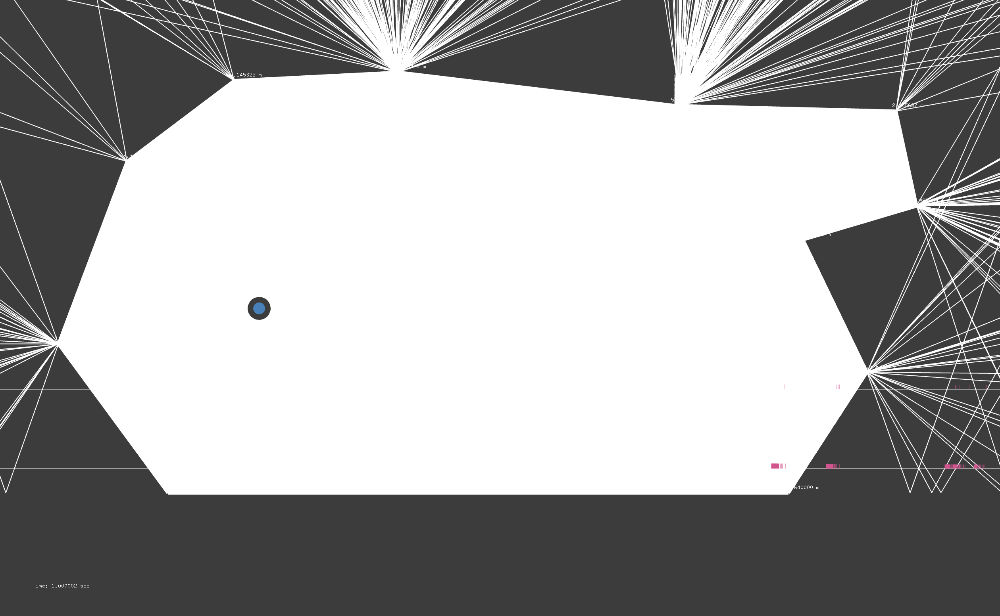
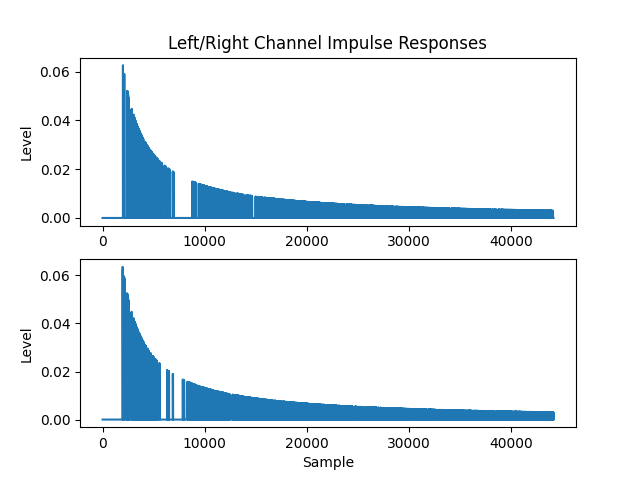
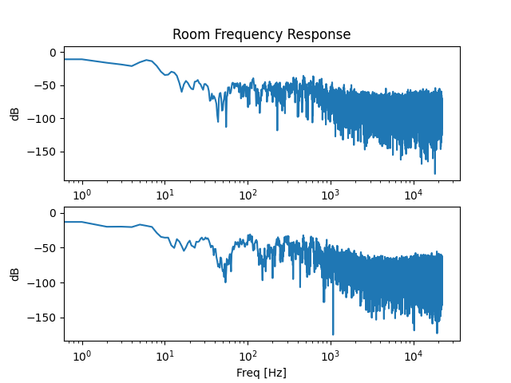

# Simple Acoustic Ray Tracer



A very bare-bones acoustic ray tracer that allows you to create a room and create a rough rough rough approximation of the early reverberations.
This codebase depends on openFrameworks which handles the GUI portion of the ray tracer.

This is a work in progress.  Over time, we hope to add better acoustics and material modelling and eventually, the ability to make 3D rooms.

## Example
In this example, the following large room is modelled:


The following image shows the ray trace for a simulation time of 1 sec:

Note that there are a significant number of rays escaping the room (likely due to the ray-wall collision detector unable to handle the discontinuity between two walls.  This needs to be fixed).

The ray trace of the room leads to the following impulse response approximation:


Converted to the frequency domain:


The resulting impulse response can be used in a convolution reverb routine.  When applied to an audio sample, the sample takes on a noticeably reverberant characteristic.  There is a very grainy texture when listening directly to the impulse response which is expected since a relatively small number of rays will leave gaps between the impulse response samples.


## Building the Code
First, download the latest version of [openFrameworks](https://openframeworks.cc).  The easiest way to start is to create a new openFrameworks project using the project generator (openFrameworks_folder/projectGenerator), then copy the source files in this repo.  You should be able to build and run the code.  Note that you may need to change the window size in main.cpp.

## Running
When running the application, first create a room by pressing **w**.  Click to add corners.  Hold shift while moving the mouse to create horizontal/vertical lines.
**When making a room, you must add corners in a clockwise fashion!**
The room is complete when your last corner matches the first corner (ie.  You have closed the room).  *Tip:  To close the room, hold shift and bring your mouse pointer near the first point.  The mouse will automatically snap to the first point*

Next, add a listener by pressing **l**.  Click and drag it to your desired position.

Then, add an emitter by pressing **e**.  Click and drag it to your desired position.

Finally, to start the simulation, press **s**.  Two files, *irLeft.txt* and *irRight.txt* will be written to the path specified in the following lines in Solver.cpp:

```cpp
_outputFileLeft.open("your_path_here");
_outputFileRight.open("your_path_here");
```

These files can be parsed to extract the IR and eventually apply it to your convolution reverb process.


## TODO
- [x] Basic operation (create world, generate rays, animate ray propgation)
- [ ] Add CMake compatibility and Unit Testing targets
- [ ] Offload ray trace operation to separate thread, draw snapshots of ray propagation at each frame change
- [ ] Add better acoustic modelling
- [ ] Add portaling and diffraction
- [ ] Add wall material properties
- [ ] Make ray reflection code more robust (handle discontinuous case between two walls)
- [ ] Apply SIMD to reflection code?
- [ ] Add better drawing of impulse response
- [ ] Add ability to make 3D world
- [ ] Add ability to communicate impulse response to other applications via OSC (or something else)
- [ ] Offload calculations to GPU?